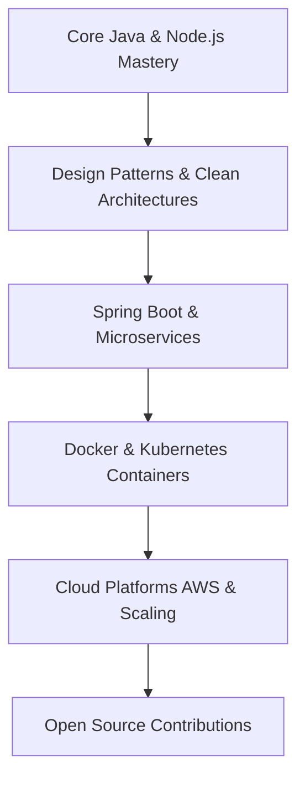

<!-- ==========================================
      GITHUB PROFILE README: VISHNU R
      ========================================== -->

<!-- 1. Premium Header Banner & Profile Image -->
<p align="center">
  
</p>

<!-- 2. Typing Animation -->
<div align="center">
  
</div>

<p align="center">
  
</p>

<br />

<!-- 3. Professional Introduction / About Me -->
<table width="100%" border="0" cellpadding="10" cellspacing="0">
  <tr>
    <td width="60%" valign="top">
      <h3>🚀 About Me</h3>
      <p>I am an ambitious, backend-focused Software Developer with a strong foundation in Java, JavaScript, and database systems. I specialize in designing structured backend architectures, RESTful APIs, and responsive applications. My passion lies in clean code, algorithmic problem-solving, and building high-performance systems that solve real-world problems.</p>
      <ul>
        <li><strong>Education</strong>: B.Tech in Information Technology (CGPA: 8.85)</li>
        <li><strong>Institution</strong>: RP Sarathy Institute of Technology, Salem, Tamil Nadu, India</li>
        <li><strong>Career Goal</strong>: To engineer scalable backend systems, robust APIs, and optimized databases in product-driven environments.</li>
      </ul>
    </td>
    <td width="40%" valign="top">
      <h4>📊 Most Used Languages</h4>
      <pre>
HTML        ████████████████████ 40%
JavaScript  ████████████████     30%
JAVA        ████████████         15%
CSS         ██████████           10%
SQL         ████                 5%
      </pre>
    </td>
  </tr>
</table>

<br />

<!--STARTS_HERE_QUOTE_CARD-->
<p align="center">
    
</p>
<!--ENDS_HERE_QUOTE_CARD-->

---

<!-- 5. Tech Stack -->
## 💻 Tech Stack & Tooling

<table width="100%">
  <tr>
    <td valign="top" width="50%">
      <h4>Languages</h4>
      
      
      
      
    </td>
    <td valign="top" width="50%">
      <h4>Backend</h4>
      
      
      
      
    </td>
  </tr>
  <tr>
    <td valign="top" width="50%">
      <h4>Databases</h4>
      
      
    </td>
    <td valign="top" width="50%">
      <h4>Mobile Development</h4>
      
      
      
    </td>
  </tr>
  <tr>
    <td valign="top" width="50%">
      <h4>Frontend</h4>
      
      
      
    </td>
    <td valign="top" width="50%">
      <h4>Tools & Deployment</h4>
      
      
      
      <br/>
      
      
      
    </td>
  </tr>
</table>

---

<!-- 6. Top 3 Projects -->
## 📁 Top 3 Projects

### 🌟 HabitFlow — Habit Tracking Web Application (Flagship Project)
> A comprehensive personal productivity dashboard that helps users establish long-term habits through visual progress analytics and streak auditing.

```yaml
Architecture: Client-Side Single Page Application (SPA)
Database: Firestore (NoSQL Document Store)
Hosting: Vercel Edge Serverless
Metrics: Optimized for sub-second database operations & state synchronization
```

*   **The Problem**: Traditional habit trackers lack dynamic visual feedback and persistent synchronization across devices, which results in low user retention and high drop-offs.
*   **The Solution**: Developed a responsive web app using a clean component-based vanilla JS design, using Chart.js for dynamic visualization and Firestore to handle secure, cloud-synced user data.
*   **Key Features**:
    *   📅 Multi-scale habit tracking (Daily, Weekly, Monthly views).
    *   🔥 Real-time streak monitoring and calendar-based progression tracking.
    *   📊 Visual productivity dashboards using Chart.js.
    *   💾 Persistence via LocalStorage fallback, with dynamic Cloud synchronization.
*   **Skills Demonstrated**: State management, asynchronous API integration, database schema optimization, chart rendering.
*   **Architecture Highlights**: Structured as a decoupled frontend client that interfaces asynchronously with Google Firestore, caching local states to ensure offline operation.

---

### 💳 Chit Fund Management System
> A secured web portal built to digitize and automate ledger tracking, administrative audits, and payments for chit fund programs.

```yaml
Architecture: RESTful API Backend + MVC Client Interface
Database: MongoDB (Document Model)
Hosting: Railway (Backend API) & Netlify (Frontend Client)
Security: Role-Based Access Control (RBAC) + JWT validation
```

*   **The Problem**: Manual ledger systems for chit funds are highly error-prone, vulnerable to security tampering, and lack transactional transparency for members.
*   **The Solution**: Engineered an API-driven ledger system with Express.js routing, utilizing MongoDB collections to track member payments, administrative logs, and transaction states.
*   **Key Features**:
    *   🔒 Secure JWT-based Authentication with HTTP-only cookies.
    *   👥 Admin Dashboard for member onboarding, bid records, and auction schedules.
    *   💰 Payment tracking with status flags (`Paid`/`Unpaid`) and automated late-fee checks.
    *   📄 Dynamic PDF/CSV report generation for member statements.
*   **Skills Demonstrated**: Database relationships inside NoSQL, cryptographic hashing, middleware routing, and microservice deployment.
*   **Architecture Highlights**: Implemented middleware layers for role validation and exception handling, ensuring database operations are transactional and isolated.

---

### 🔍 Barcode Payment Android Application
> A native mobile tool built to optimize customer checkouts in retail locations by leveraging camera hardware for barcode scanning and secure transaction routing.

```yaml
Architecture: Model-View-Controller (MVC) Android Architecture
Libraries: ZXing Barcode Scan Engine, native Android Camera2 API
Tooling: Android Studio & Java SDK
```

*   **The Problem**: Retail cashier terminals experience high congestion during peak hours due to bottlenecked barcode hardware, causing long wait times.
*   **The Solution**: Created a native Android app that offloads scanning to customer devices, utilizing camera processing to decode barcodes and initiate payment workflows.
*   **Key Features**:
    *   📷 High-speed, multithreaded barcode capturing using ZXing.
    *   👤 Decoupled customer and administrator modules.
    *   💳 Standardized payment routing mock-up for secure checkouts.
    *   📶 Local database backup using SQLite for offline cache.
*   **Skills Demonstrated**: Native Android development, hardware camera integration, multithreading, and resource-efficient image decoding.
*   **Architecture Highlights**: Developed scanning actions on background threads to prevent UI-blocking, resulting in a smooth 60fps viewfinder experience.

---

<!-- 7. Internship Experience -->
## 💼 Internship Experience

#### **Full Stack Java Developer Intern** | NextGen Solutions
_Salem, Tamil Nadu, India_
```yaml
Focus Areas: Enterprise OOP Architectures, Collection Models, Exception Handling workflows
Tooling: Eclipse IDE, MySQL Database, Git, Java 8/11 SDK
```
- Designed and documented object-oriented modules in Java, enforcing encapsulation, inheritance, and polymorphic structures.
- Streamlined transactional logic and dataset queries utilizing Java Collections Framework (List, Map, Set).
- Implemented robust exception-handling hierarchies across backend services, improving system stability.
- Collaborated in designing basic web application modules, integrating REST request handling.

---

<!-- 8. Achievements & Certifications -->
## 🏆 Achievements & Certifications

*   🥇 **1st Prize Winner at Project Expo**: Awarded for designing and demonstrating an optimized software application with outstanding UI/UX and system architecture.
*   📜 **NPTEL Elite Certification – Joy of Computing Using Python**: Verified proficiency in computational logic, algorithmic scripting, and problem-solving.
*   🎓 **Core Java Certification**: Documented mastery of OOPs design patterns, JVM structures, memory management, and multithreaded workflows.
*   📊 **Data Science for Beginners Certification**: Foundational training in data manipulation, statistics, and analytic plotting models.

---

<!-- 9. GitHub Analytics -->
## 📊 GitHub Analytics

<table width="100%" border="0" cellpadding="0" cellspacing="5">
  <tr>
    <td width="50%" align="center">
      <a href="https://github.com/Vishnuat18">
        
      </a>
    </td>
    <td width="50%" align="center">
      <a href="https://github.com/Vishnuat18">
        
      </a>
    </td>
  </tr>
</table>

<br />

<h3 align="center">Contribution Activity Graph</h3>
<p align="center">
  
</p>

---

<!-- 10. Current Learning Journey -->
## 🎯 Current Learning Journey

- ☕ **Advanced Java**: Mastery of Java Streams, Concurrency models, JVM tuning, and Garbage Collection models.
- 📐 **Data Structures & Algorithms**: Intensive optimization practice focusing on Graph traversals, Dynamic Programming, and tree complexities.
- 🖥️ **System Design Fundamentals**: Understanding Low-Level Design (LLD) principles, design patterns (Creational, Structural, Behavioral), and High-Level Design (HLD) concepts.
- 🗄️ **Database Design**: Transaction isolation levels, indexing mechanics, and query execution planning.

---

<!-- 11. 2027 My Roadmap -->
## 🗺️ 2027 My Roadmap



---

<!-- 12. Coding Profiles -->
## 💻 Coding Profiles

<p align="center">
  <a href="https://github.com/Vishnuat18" target="_blank">
    
  </a>
  <a href="https://linkedin.com/in/vishnu-r-a41884300" target="_blank">
    
  </a>
  <a href="https://leetcode.com/Vishnuat18" target="_blank">
    
  </a>
</p>

---

<!-- 13. Open Source Goals -->
## 🌐 Open Source Goals

- 🚀 Contribute to core backend engines, MVC routing frameworks, and database connectors.
- 🐛 Solve issues in open-source developer tooling and mock testing libraries.
- 📖 Expand technical documentations and API tutorials to support emerging developers.

---

<!-- 14. Contact Section -->
## 🤝 Connect With Me

<p align="center">
  I am actively seeking backend engineering roles, software developer internships, and open-source collaborations.
</p>

<p align="center">
  <a href="mailto:vishnurajan24766@gmail.com" target="_blank">
    
  </a>
  <a href="https://linkedin.com/in/vishnu-r-a41884300" target="_blank">
    
  </a>
</p>

---

<!-- 15. GitHub Snake Contribution Animation -->
## 🐍 Contribution Activity
<p align="center">
  <picture>
    <source media="(prefers-color-scheme: dark)" srcset="https://raw.githubusercontent.com/Vishnuat18/Vishnuat18/output/github-contribution-grid-snake-dark.svg" />
    <source media="(prefers-color-scheme: light)" srcset="https://raw.githubusercontent.com/Vishnuat18/Vishnuat18/output/github-contribution-grid-snake.svg" />
    
  </picture>
</p>

<!-- 16. Premium Footer -->
<p align="center">
  
</p>
